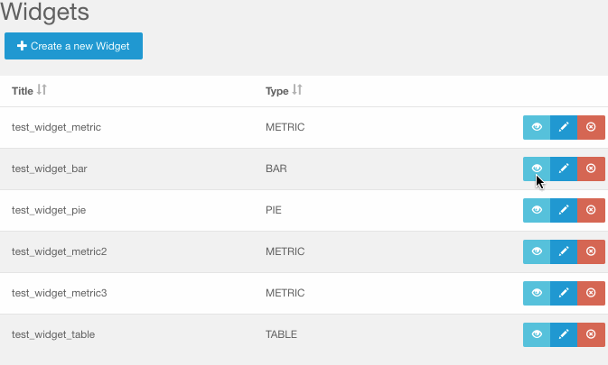
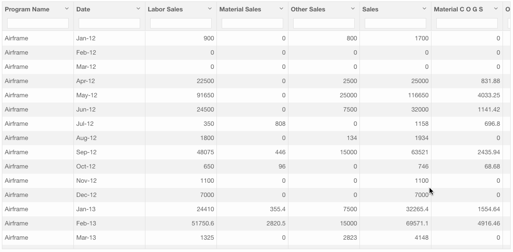
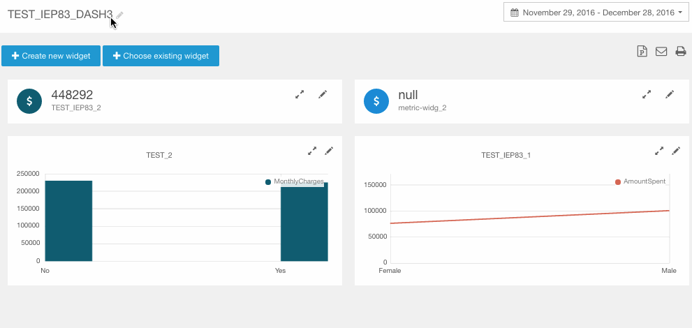
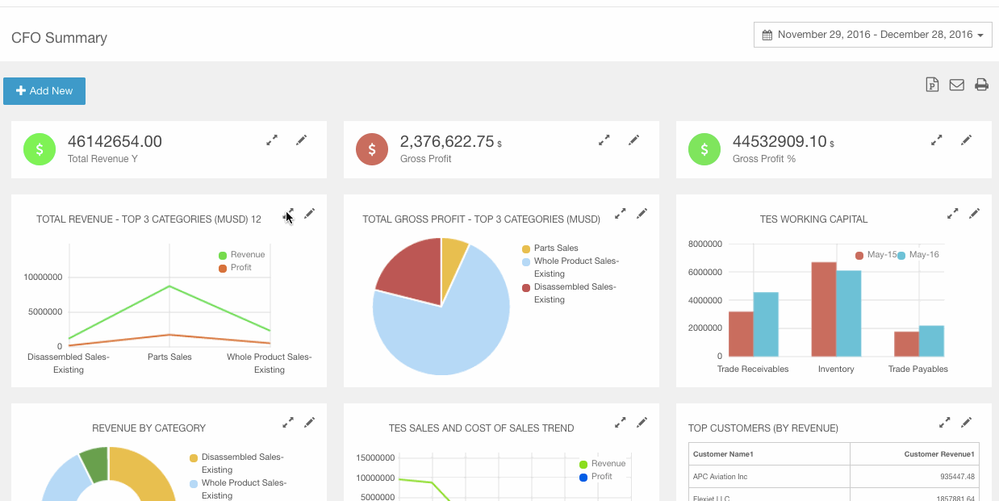

## Intro / Bio

Hello World, this is [Manjari Pokala](https://www.linkedin.com/in/manjari-pokala). Currently working as an Application Developer at a Big Data startup [Datalakes Inc](http://www.datalakes.com). 

Experienced in following aspects of the stack:

* [AngularJS](http://angularjs.org/)
* [Twitter Bootstrap](http://getbootstrap.com/)
* [Maven](http://maven.apache.org/)
* [Spring MVC REST](http://spring.io/guides/gs/rest-service/)
* [Spring Data JPA](http://projects.spring.io/spring-data-jpa/)
* [Liquibase](http://www.liquibase.org/) (for database updates)
* [PostgreSQL](https://www.postgresql.org/)

## About Blog

Documenting few of the interesting feature enhancements & related findings I contributed to in our Integrated Application Platform.  

## SQL / Databse

- [REST API Calls](#rest-api-calls)
- [Stored Procedures](#stored-procedures)
- [Liquibase DB Update](#liquibase-db-update)

## Angular JS

-	[Infinite Scroll with Lazy Loading](#infinite-scroll-with-lazy-loading)
-	[Auto Authenticate on Sign In](#auto-authenticate-on-sign-in)
-	[BootStrap Grid Behavior](#bootstrap-grid-behavior)
-	[Maximize Widgets](#maximize-widgets)
- [Track By](#track-by)

REST API Calls
--------------

Stored Procedures
-----------------

Liquibase DB Update
-------------------

Infinite Scroll with Lazy Loading
---------------------------------

It is often desirable to fetch a small number of rows from a huge table to help with page the page load times.

Auto Authenticate on Sign In
----------------------------

Fetch the user information without the need for refreshing the sign in page.

BootStrap Grid Behavior
-----------------------

Combine the classes to use change column widths on different grid sizes.

\
..\

Maximize Widgets
----------------

Track By
--------

The track by needs to be at the end of the expression of ng-repeat.

\<li ng-repeat="person in attendees | filter: {arrived: false } track by person.id">

## About Datalakes

Datalakes **I**nformation **E**xperience **P**latform is a Business Intelligence and Analytics solution on the Cloud. It addresses all the aspects of Data-to-Information cycle : Acquire, Process, Store, Analyze, Visualize and Publish - all delivered as a self service platform. The platform provides an easy access to the stunning dashboards from any browser or mobile device.

Thanks to founders [Krishna](https://www.linkedin.com/in/krishnaanisetty) & [Rajeev](https://www.linkedin.com/in/rajeevps) for giving me the opportunity to work on the cool app. 

Please feel free to watch the [demo](http://datalakes.com/demo/) to know more about our platform.

Screenshot of the Datalakes IEP app in action

Thanks for visiting. Feedback appreciated.
