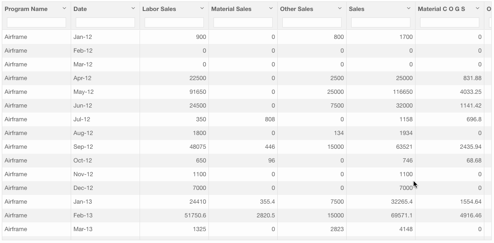

## Intro / Bio

Hello World, this is [Manjari Pokala](https://www.linkedin.com/in/manjari-pokala). Currently working as an Application Developer at a small Big Data startup [Datalakes Inc](http://www.datalakes.com). My past experience is in Java based web application development.

## About Datalakes

Datalakes Information Experience Platform is a Business Intelligence and Analytics solution on the Cloud. It addresses all the aspects of Data-to-Information cycle : Acquire, Process, Store, Analyze, Visualize and Publish - all delivered as a self service platform. The platform provides an easy access to the stunning from any browser or mobile device.

Thanks to founders [Krishna](https://www.linkedin.com/in/krishnaanisetty) & [Rajeev](https://www.linkedin.com/in/rajeevps) for giving me the opportunity to work on the cool app. 

Please feel free to watch the [demo](http://datalakes.com/demo/) to know more about our platform.

Screenshot of the Datalakes IEP app in action


## About Blog

Documenting few of the interesting feature enhancements I worked on in our Integrated Application Platform.  

-	[Infinite Scroll with Lazy Loading](#infinite-scroll-with-lazy-loading)
-	[Auto Authenticate on Sign In](#auto-authenticate-on-sign-in)
-	[BootStrap Grid Behavior](#bootstrap-grid-behavior)
- [Track By](#track-by)


Infinite Scroll with Lazy Loading
---------------------------------



It is often desirable to fetch a small number of rows from a huge table to help with page the page load times.


Auto Authenticate on Sign In
----------------------------

Fetch the user information without the need for refreshing the sign in page.

BootStrap Grid Behavior
-----------------------

Combine the classes to use change column widths on different grid sizes.

\<div class="col-md-3 col-sm-6">..\</div>


Track By
--------

The track by needs to be at the end of the expression of ng-repeat.

\<li ng-repeat="person in attendees | filter: {arrived: false } track by person.id">


## Welcome to GitHub Pages

You can use the [editor on GitHub](https://github.com/manjaripokala/dl-angular/edit/master/README.md) to maintain and preview the content for your website in Markdown files.

Whenever you commit to this repository, GitHub Pages will run [Jekyll](https://jekyllrb.com/) to rebuild the pages in your site, from the content in your Markdown files.

### Markdown

Markdown is a lightweight and easy-to-use syntax for styling your writing. It includes conventions for

```markdown
Syntax highlighted code block

# Header 1
## Header 2
### Header 3

- Bulleted
- List

1. Numbered
2. List

**Bold** and _Italic_ and `Code` text

[Link](url) and 
```

For more details see [GitHub Flavored Markdown](https://guides.github.com/features/mastering-markdown/).

### Jekyll Themes

Your Pages site will use the layout and styles from the Jekyll theme you have selected in your [repository settings](https://github.com/manjaripokala/dl-angular/settings). The name of this theme is saved in the Jekyll `_config.yml` configuration file.

### Support or Contact

Having trouble with Pages? Check out our [documentation](https://help.github.com/categories/github-pages-basics/) or [contact support](https://github.com/contact) and we’ll help you sort it out.
